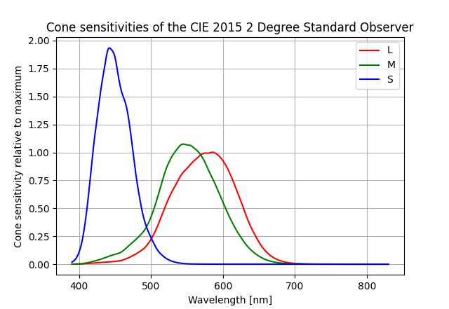
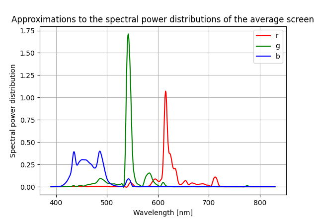
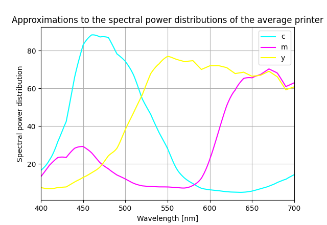

# Theory: Color Vision Deficiency Simulation

This page explains the mathematical foundation behind how the `cvd` package simulates color vision deficiencies. Understanding this theory helps you appreciate how the transformations work and why they produce realistic simulations of color blindness. This is based on ["A Physiologically-based Model for Simulation of Color Vision Deficiency"](doi.org/10.1109/TVCG.2009.113) by Gustavo M. Machado, Manuel M. Oliveira.

## Overview

Color vision deficiency (CVD) simulation transforms colors according to scientific models of how different types of color blindness affect human color perception. The process involves adjusting the cone sensitivities in the human eye and then transforming colors through a well-defined mathematical pipeline.

## The Simulation Pipeline

The CVD simulation follows a systematic six-step process:

### Step 1: Adjusted Cone Sensitivities

For a given CVD type, we first obtain adjusted cone sensitivities. The human eye has three types of cone cells:
- **L cones** (Long wavelength) - most sensitive to red
- **M cones** (Medium wavelength) - most sensitive to green
- **S cones** (Short wavelength) - most sensitive to blue

The adjusted sensitivities account for:

- **Cone shift** ($\Delta\lambda_S \in [0,60]$) for S cone cells
- **Severity factors** ($\alpha_L, \alpha_M \in [0,1]$) for protanopia and deuteranopia

The mathematical formulas for adjusted cone sensitivities are:

$$\begin{align*}
L_a(\lambda) &= (1-\alpha_L) L(\lambda) + 0.96\frac{\textrm{Area}_L}{\textrm{Area}_M}\alpha_L M(\lambda)\\ 
M_a(\lambda) &= (1-\alpha_M) M(\lambda) + \frac{1}{0.96}\frac{\textrm{Area}_M}{\textrm{Area}_L}\alpha_M L(\lambda)\\ 
S_a(\lambda) &= S(\lambda + \Delta\lambda_S)
\end{align*}$$

Where:
- $L(\lambda), M(\lambda), S(\lambda)$ are the original cone sensitivity functions
- $L_a(\lambda), M_a(\lambda), S_a(\lambda)$ are the adjusted sensitivity functions
- $\alpha_L, \alpha_M$ control the severity (0 = normal vision, 1 = full colorblindness)
- The area ratios account for the different densities of cone types in the retina
- The factor 0.96 is a magic number that Machado et al. figured out is helpful

### Step 2: Opponent-Color-Model Basis Functions

Human color vision can be understood via opponent color theory, where colors are perceived through opposing pairs:
- **White-Black (Luminance)** - WS
- **Yellow-Blue** - YB
- **Red-Green** - RG

For the adjusted cone sensitivities, we compute the opponent-color-model basis functions:

$$\begin{align*}
\begin{pmatrix}WS(\lambda)\\ YB(\lambda)\\ RG(\lambda)\end{pmatrix} = 
\begin{pmatrix}0.6 & 0.4 & 0 \\ 0.24 & 0.105 & -0.7 \\ 1.2 & -1.6 & 0.4\end{pmatrix} 
\begin{pmatrix}L_a(\lambda)\\ M_a(\lambda)\\ S_a(\lambda)\end{pmatrix}
\end{align*}$$

This matrix transformation converts from cone space to the opponent color space that allows us to better model CVDs.

### Step 3: Spectral Power Distributions

For each color channel in the color model (e.g., R, G, B in RGB), we obtain the spectral power distributions $\varphi_C(\lambda)$. These describe how much light of each wavelength is emitted or reflected by a color.

The spectral power distributions depend on the color model:
- **RGB**: Based on monitor characteristics
- **CMYK**: Based on printer ink and paper characteristics
- **Other models**: Converted to RGB/CMYK first

### Cone Sensitivity Functions

The simulation uses the CIE 2015 2° Standard Observer cone sensitivity data. These functions describe how sensitive each type of cone cell is to different wavelengths of light.

### RGB Spectral Power Distributions

For RGB colors, we use the measured spectral power distributions for an Apple Studio LCD display. This approximates the color characteristics of a typical monitor.

### CMYK Spectral Power Distributions

For CMYK colors, we use example reflectivities for an ink-jet printer from Abebe 2011, multiplied by standard illuminant A. This approximates the average printer, paper, and lighting conditions for a subtractive color model.

Note that CMYK is a subtractive color model, so the spectral power distributions are modeled with a dip around peak absorption rather than a Gaussian peak.

### Step 4: Projection to Opponent Color Space

We project the spectral power distributions onto the opponent color model basis functions. This is done by forming a matrix of convolutions:

$$\begin{align*}
\hat T_{i,C} = \int \varphi_C(\lambda) O_i(\lambda)\,\textrm{d}\lambda
\end{align*}$$

Where $O_i(\lambda)$ are the opponent color basis functions (WS, YB, RG).

This step essentially calculates how much each color channel stimulates each of the opponent color mechanisms.

### Step 5: Normalization

We form the normalized transformation matrix $T$ by applying normalization factors $\rho_i$:

$$\begin{align*}
\rho_i = \frac{1}{\sum_C \hat T_{i,C}}
\end{align*}$$

And then:

$$T_{i,C} = \rho_i \hat T_{i,C}$$

This normalization ensures that the transformation preserves certain perceptual properties and maintains consistency across different color spaces.

### Step 6: Final Color Transformation

To obtain the simulated color for a person with normal color vision experiencing a particular CVD, we apply the transformation:

$$\begin{align*}
\vec C_s = T^{-1}_{\textrm{normal}} T \vec C
\end{align*}$$

Where:
- $\vec C$ are the original color values (e.g., $(r,g,b)$)
- $T$ is the transformation matrix for the CVD being simulated
- $T_{\textrm{normal}}$ is the transformation matrix for normal vision
- $\vec C_s$ are the simulated color values as perceived by someone with normal vision but showing what a person with CVD would see

## References

The simulation methodology is based on established color vision science and implemented in the Python `colour` library ([colour-science/colour](https://github.com/colour-science/colour)), which provides the underlying color science computations.

An implementation of the described pipeline of creating the 3x3 transformation matrices is implemented in [simon-pfahler/simon-pfahler/CVD-simulation-generator](https://github.com/simon-pfahler/CVD-simulation-generator).

For more details on the mathematical foundations, ["A Physiologically-based Model for Simulation of Color Vision Deficiency"](https://doi.org/10.1109/TVCG.2009.113) by Gustavo M. Machado, Manuel M. Oliveira.
